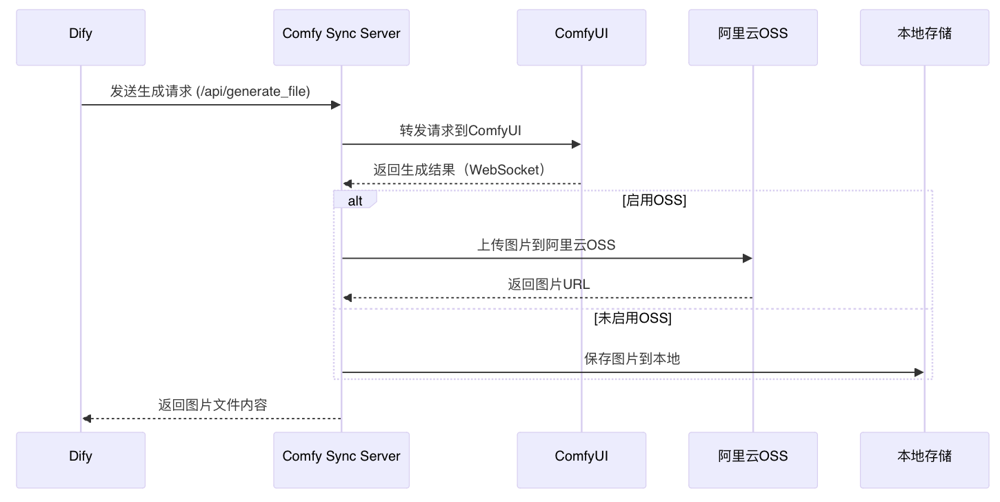

# Comfy Sync Server

这是一个基于FastAPI的服务器，用于同步接收请求，转发至ComfyUI，并同步返回图片URL或直接返回图片文件。

## 功能特点

- 接收包含workflow数据的请求
- 转发请求至ComfyUI服务器
- 实时监听WebSocket消息，获取生成进度
- 将生成的图片保存到本地
- 支持配置是否使用阿里云OSS存储图片
- 如不使用OSS，则通过本地HTTP服务器提供图片访问
- 支持两种响应方式：
  - 返回图片URL
  - 直接返回图片文件内容，**专为Dify工作流设计**，详细使用示例见`dify-chatflow-demo.yml`

## 与Dify的集成

本项目特别为Dify工作流优化，提供了`/api/generate_file`接口，可以直接返回图片文件内容，方便在Dify工作流中使用。

### 泳道图




### 使用步骤

1. 在Dify中创建新的工作流
2. 使用`HTTP Request`节点调用本项目的`/api/generate_file`接口
3. 将返回的图片文件内容传递给后续节点处理

### 示例文件

项目中包含`dify-chatflow-demo.yml`文件，展示了如何在Dify工作流中使用本项目的API。您可以直接导入该文件到Dify中，快速开始使用。


## 安装

1. 克隆仓库：

```bash
git clone https://github.com/wengxiaoxiong/comfy_sync_server.git
cd comfy_sync_server
```

2. 安装依赖：

```bash
pip install -r requirements.txt
```

3. 配置环境变量：

复制`.env.example`文件为`.env`，并填写相关配置：

```bash
cp .env.example .env
```

编辑`.env`文件，填写以下配置：

```bash
# ComfyUI服务器配置
COMFYUI_SERVER=your_comfyui_server_address

# 服务器配置
ENABLE_OSS=true  # 设置为false禁用阿里云OSS，使用本地HTTP服务器
SERVER_BASE_URL=http://example.com  # 服务器基础URL，用于生成本地图片URL

# 阿里云OSS配置
OSS_ACCESS_KEY_ID=your_access_key_id
OSS_ACCESS_KEY_SECRET=your_access_key_secret
OSS_ENDPOINT=your_endpoint
OSS_BUCKET_NAME=your_bucket_name
OSS_BASE_PATH=comfy_images/
```

## 运行

```bash
uvicorn main:app --host 0.0.0.0 --port 3000 --reload
```

或者直接运行：

```bash
python main.py
```

服务器将在 http://localhost:3000 上启动。

## 使用Docker部署

### 使用Dockerfile构建并运行

1. 构建Docker镜像：

```bash
docker build -t comfy_sync_server .
```

2. 运行Docker容器：

```bash
docker run -d -p 3000:3000 -v $(pwd)/output_images:/app/output_images -v $(pwd)/.env:/app/.env --name comfy_sync_server comfy_sync_server
```

### 使用Docker Compose部署

1. 使用以下命令启动服务：

```bash
docker-compose up -d
```

2. 查看日志：

```bash
docker-compose logs -f
```

3. 停止服务：

```bash
docker-compose down
```

服务器将在 http://localhost:3000 上启动。

## API文档

启动服务器后，可以访问 http://localhost:3000/docs 查看API文档。

### 生成图片并返回URL

**请求**：

```
POST /api/generate
```

**请求体**：

注意输出的节点用SaveImageWebsocket

```json

{
    "workflow_data": {
      "3": {
        "inputs": {
        "seed": 543787440026212,
        "steps": 20,
        "cfg": 8,
        "sampler_name": "euler",
        "scheduler": "normal",
        "denoise": 1,
        "model": [
            "4",
            0
        ],
        "positive": [
            "6",
            0
        ],
        "negative": [
            "7",
            0
        ],
        "latent_image": [
            "5",
            0
        ]
        },
        "class_type": "KSampler",
        "_meta": {
        "title": "K采样器"
        }
    },
    "4": {
        "inputs": {
        "ckpt_name": "sd_xl_base_kv_.safetensors"
        },
        "class_type": "CheckpointLoaderSimple",
        "_meta": {
        "title": "Checkpoint加载器（简易）"
        }
    },
    "5": {
        "inputs": {
        "width": 512,
        "height": 512,
        "batch_size": 1
        },
        "class_type": "EmptyLatentImage",
        "_meta": {
        "title": "空Latent图像"
        }
    },
    "6": {
        "inputs": {
        "text": "beautiful scenery nature glass bottle landscape, , purple galaxy bottle,",
        "clip": [
            "4",
            1
        ]
        },
        "class_type": "CLIPTextEncode",
        "_meta": {
        "title": "CLIP文本编码"
        }
    },
    "7": {
        "inputs": {
        "text": "text, watermark",
        "clip": [
            "4",
            1
        ]
        },
        "class_type": "CLIPTextEncode",
        "_meta": {
        "title": "CLIP文本编码"
        }
    },
    "8": {
        "inputs": {
        "samples": [
            "3",
            0
        ],
        "vae": [
            "4",
            2
        ]
        },
        "class_type": "VAEDecode",
        "_meta": {
        "title": "VAE解码"
        }
    },
    "9": {
        "inputs": {
        "filename_prefix": "ComfyUI",
        "images": [
            "8",
            0
        ]
        },
        "class_type": "SaveImageWebsocket",
        "_meta": {
        "title": "保存图像"
        }
    }
    },
  "output_node_id": 0,
  "type":"file"
},
    "output_node_id": 277,
    "response_type": "url"  // 可选，默认为"url"
}
```

**响应**：

```json
{
    "url": "https://your-bucket.your-endpoint.com/comfy_images/image_1234567890.png"
}
```

### 生成图片并直接返回文件

**请求**：

```
POST /api/generate_file
```

**请求体**：

```json
{
    "workflow_data": {
        // ComfyUI工作流数据
    },
    "output_node_id": 277
}
```

**响应**：

直接返回图片文件内容（二进制数据），Content-Type为`image/png`，并带有`Content-Disposition`头，指示浏览器下载文件。

### 选择合适的接口

- 如果您需要在前端显示图片，建议使用`/api/generate`接口获取URL
- 如果您需要直接下载图片文件或将图片保存到本地，建议使用`/api/generate_file`接口
- 两个接口的处理逻辑相同，只是返回格式不同

## 存储配置说明

### 使用阿里云OSS存储（默认）

当`ENABLE_OSS=true`时，系统会将生成的图片上传到阿里云OSS，并返回带有签名的URL（有效期30天）。

需要配置以下环境变量：
- OSS_ACCESS_KEY_ID
- OSS_ACCESS_KEY_SECRET
- OSS_ENDPOINT
- OSS_BUCKET_NAME
- OSS_BASE_PATH（可选）

### 使用本地HTTP服务器存储

当`ENABLE_OSS=false`或阿里云OSS配置不完整时，系统会使用本地HTTP服务器存储图片。

此时，可以通过`SERVER_BASE_URL`环境变量设置服务器的基础URL，例如：
```
SERVER_BASE_URL=http://example.com
```

返回的图片URL将为：`http://example.com/output_images/image_1234567890.png`

如果未设置`SERVER_BASE_URL`，则返回相对路径：`/output_images/image_1234567890.png`

## 注意事项

- 确保ComfyUI服务器已经启动并可访问
- 生成的图片会保存在`output_images`目录下
- 如果使用本地HTTP服务器存储图片，请确保设置正确的`SERVER_BASE_URL`，避免返回本地才能访问的地址
- 使用`/api/generate_file`接口时，图片仍会保存到本地和OSS（如果启用），但响应会直接返回图片内容

## 许可证

MIT 